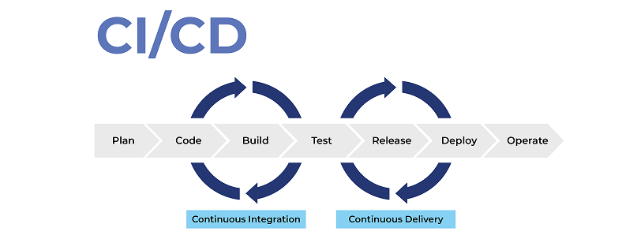

# CICD en una Aplicación

- [CICD en una Aplicación](#cicd-en-una-aplicación)
  - [Teoría](#teoría)
  - [Práctica](#práctica)
    - [CICD en una aplicación usando CircleCI - Inner Loop](#cicd-en-una-aplicación-usando-circleci---inner-loop)
      - [Linting](#linting)
      - [Testing](#testing)
      - [Analisis de código estático](#analisis-de-código-estático)
      - [Release](#release)
    - [CICD en un monorepo usando CircleCI](#cicd-en-un-monorepo-usando-circleci)


## Teoría

Slides:
1. Fases de Un Pipeline: Pruebas. [Slides](slides/04-fases-pipeline.pdf)


## Práctica

Requisitos previos:
- Tener una cuenta en Github
- Tener una cuenta en CircleCI
- Tener una cuenta en SonarCloud

Objetivos:
- Configurar el inner loop de una aplicación usando CircleCI
  - Linting
  - Testing
  - Analisis de código estático

### CICD en una aplicación usando CircleCI - Inner Loop



Cuando hablamos de CICD, podemos hablar del inner loop y del outer loop. El inner loop es el proceso de CICD que se ejecuta cada vez que se hace un commit en el repositorio. El outer loop es el proceso de CICD que se ejecuta cuando se hace un release de la aplicación.

En esta práctica, vamos a ver como configurar el inner loop de una aplicación usando CircleCI. Para ello, vamos a usar una aplicación de ejemplo que se encuentra en el directorio `app`. Esta aplicación es una aplicación de NodeJS que es un paquete de npm. Esta aplicación tiene un fichero `package.json` que contiene los scripts necesarios para ejecutar el linting, los tests y el análisis de código estático.

#### Linting

Cuando se desarrolla en equipo, es importante que el código siga un estilo común. Para ello, se pueden usar herramientas de linting que nos ayuden a mantener un estilo común en el código. A este proceso se le llama linting.

Si has usado lenguajes como Python, Javascript o Go, seguro que has usado alguna herramienta de linting. En el caso de Python, la herramienta más conocida es [Pylint](https://www.pylint.org/). En el caso de Javascript, la herramienta más conocida es [ESLint](https://eslint.org/). En el caso de Go, la herramienta más conocida es [Golang CI Lint](https://github.com/golangci/golangci-lint).

Esta aplicacion usa el paquete `standard` de npm para hacer el linting junto con el paquete `snazzy`. El paquete `standard` es un paquete que usa ESLint por debajo y que tiene una serie de reglas predefinidas. El paquete `snazzy` es un paquete que hace que la salida de ESLint sea más legible.
Para ejecutar el linting, ejecuta el siguiente comando:

```bash
npm run lint
```

El output también se puede guardar en un fichero. Para ello, ejecuta el siguiente comando:

```bash
npm run lint:report
```

Hay que tener en cuenta que el linting no arregla los errores, solo los muestra. Para arreglar los errores, hay que arreglarlos a mano. Aúnn así, hay errores que se pueden arreglar automaticamente. Para ello, ejecuta el siguiente comando:

```bash
npm run lint:fix
```

Vamos a añadir el linting a CircleCI. Para ello, vamos a crear un fichero `.circleci/config.yml` con el siguiente contenido:

```yaml
version: 2.1

defaults: &defaults
  working_directory: ~/repo
  docker:
    - image: cimg/node:20.5.1

jobs:
  test:
    <<: *defaults  
    steps:
      - checkout
      - restore_cache:
          keys:
          - v1-dependencies-{{ checksum "package.json" }}
          # fallback to using the latest cache if no exact match is found
          - v1-dependencies-

      - run: npm install
      - run:
          name: Run lint
          command: npm run lint:report

      - save_cache:
          paths:
            - node_modules
          key: v1-dependencies-{{ checksum "package.json" }}

            
workflows:
  test-deploy:
    jobs:
      - test:
          context: dev
          filters:
            tags:
              only: /^v.*/
```

Expliquemos el fichero:
1. En la primera linea, indicamos la version de CircleCI que vamos a usar. En este caso, vamos a usar la version 2.1
2. En la segunda linea, definimos un alias llamado `defaults` que vamos a usar para definir los valores por defecto de los jobs (workspace e imagen).
3. Luego, creamos los jobs. En este caso, solo tenemos un job llamado `test`. Este job tiene los valores por defecto definidos en el alias `defaults`. Tiene una serie de pasos. 
   1. El primer paso es hacer un checkout del repositorio. 
   2. El segundo paso es restaurar el cache de las dependencias de npm para optimizar el tiempo de ejecución. 
   3. El tercer paso es instalar las dependencias de npm. 
   4. El cuarto paso es ejecutar el linting.
   5. El quinto paso es guardar el cache de las dependencias de npm.

#### Testing

El testing es una parte fundamental del desarrollo de software. El testing nos permite asegurar que el software que estamos desarrollando funciona correctamente. En el caso de NodeJS, la herramienta más conocida para hacer testing es mocha. Esta aplicación usa mocha para hacer los tests. Para ejecutar los tests, ejecuta el siguiente comando:

```bash
npm run test
```

Al ejecutarlo vamos a ver el siguiente resultado:

```bash

> my-awesome-package@1.1.0 test
> mocha "tests/**/*.tests.js"

  SuperTool
    validateState (static)
      ✔ throws if the value is not a valid state
      ✔ returns nothing on a valid state
    constructor
      ✔ is created with default state
      ✔ can be created with an explicit initial state
    state
      ✔ returns the current state if no value is given
      ✔ sets the current state if the state is a valid state value
    execute
      ✔ executes the current state

  exists
    ✔ returns true if the given parameter is defined
    ✔ returns false if the given parameter is undefined or null


  9 passing (5ms)
```

Este comando ejecuta los tests que se encuentran en el directorio `tests` y se encuentran en un fichero con formato `.test.js`. Vamos a añadir los tests a CircleCI.

El output de los tests se puede guardar en un formato standard llamado JUnit. Para ello, ejecuta el siguiente comando:

```bash
npm run test:report
```

Al ejecutar este fichero vamos a ver un fichero llamado `test-report.xml`. Este fichero se puede usar para integrarlo con otras herramientas de CI/CD como por ejemplo CircleCI.

#### Analisis de código estático

El análisis de codigo estático es una parte fundamental del desarrollo de software. El análisis de código estático nos permite asegurar que el código que estamos desarrollando sigue una serie de buenas prácticas. En el caso de NodeJS, las herramienta más conocidas para hacer análisis de código estático son Istanbul, SonarJS, c8. Esta aplicación usa c8 para hacer el análisis de código estático. Para ejecutar el análisis de código estático, ejecuta el siguiente comando:

```bash
yarn test:coverage
```

Al ejecutarlo vamos a ver el siguiente resultado:

```bash
$ NODE_ENV=test c8 --all --include=lib/* --reporter=html --reporter=text --reporter=lcov mocha "tests/**/*.tests.js"


  SuperTool
    validateState (static)
      ✔ throws if the value is not a valid state
      ✔ returns nothing on a valid state
    constructor
      ✔ is created with default state
      ✔ can be created with an explicit initial state
    state
      ✔ returns the current state if no value is given
      ✔ sets the current state if the state is a valid state value
    execute
      ✔ executes the current state

  exists
    ✔ returns true if the given parameter is defined
    ✔ returns false if the given parameter is undefined or null


  9 passing (5ms)

--------------|---------|----------|---------|---------|-------------------
File          | % Stmts | % Branch | % Funcs | % Lines | Uncovered Line #s 
--------------|---------|----------|---------|---------|-------------------
All files     |     100 |      100 |   85.71 |     100 |                   
 SuperTool.js |     100 |      100 |     100 |     100 |                   
 index.js     |     100 |      100 |     100 |     100 |                   
 utils.js     |     100 |      100 |      50 |     100 |                   
--------------|---------|----------|---------|---------|-------------------
✨  Done in 0.84s.

```

Este comando ejecuta el análisis de código estático y genera un informe en formato HTML, lcov y texto por consola. Vamos a añadir el análisis de código estático a CircleCI.

el formato lcov es un formato que se usa para generar informes de cobertura de código. Este formato es usado por herramientas como SonarCloud o CodeCov.

En este caso, vamos a usar SonarCloud para hacer el análisis de código estático. Para ello, vamos a crear un proyecto en SonarCloud. Para ello, sigue los siguientes pasos:
1. Ve a [SonarCloud](https://sonarcloud.io/) y haz login con tu cuenta de Github.
2. Crea un nuevo proyecto.
3. Seleccion la opción "Previous version" para analizar el proyecto con SonarCloud y pincha en "Create Project".
4. Espera que el primer análisis este hecho.
5. Selecciona la opción de analizar el proyecto de manera manual usando CircleCI.
   1. Administration > Analysis Method > Uncheck Automatic Analysis
   2. Generamos un Token: My Account > Security > Generate Token
   3. Añadimos el token a CircleCI: Project > Project Settings > Environment Variables > Add Environment Variable. La variable se tiene que llamar `SONAR_TOKEN` y el valor es el token que hemos generado.

Posteriorimente, vamos a tener que crear un ficher `sonar-project.properties` con el siguiente contenido:

```properties
sonar.organization=xavidop
sonar.projectKey=xavidop_npm-package-template
sonar.projectName=npm-package-template
sonar.sources=lib
sonar.tests=tests
sonar.eslint.reportPaths=lint.json
sonar.javascript.lcov.reportPaths=coverage/lcov.info
```

NOTA: El valor de `sonar.organization` y `sonar.projectKey` tienen que ser el nombre de tu organización y el nombre de tu proyecto en SonarCloud.

Expliquemos el fichero:
1. En la primera linea, indicamos el nombre de la organización en SonarCloud.
2. En la segunda linea, indicamos el identificador del proyecto en SonarCloud.
3. En la tercera linea, indicamos el nombre del proyecto.
4. En la cuarta linea, indicamos el directorio donde se encuentran los ficheros de código fuente.
5. En la quinta linea, indicamos el directorio donde se encuentran los ficheros de tests.
6. En la sexta linea, indicamos el fichero de salida del linting.
7. En la septima linea, indicamos el fichero de salida del análisis de código estático.

Una vez tenemos el fichero listo, vamos a añadir el análisis de código estático a CircleCI. Para ello, vamos a modificar el fichero `.circleci/config.yml`. Lo primero que tenemos que hacer es añadir la orb de sonarcloud:
```yaml
orbs:
  sonarcloud: sonarsource/sonarcloud@2.0.0
```

Luego, vamos a añadir el comando de sonarcloud en el job `test`:
```yaml
  test:
    <<: *defaults  
    steps:
      - checkout

      - restore_cache:
          keys:
          - v1-dependencies-{{ checksum "package.json" }}
          # fallback to using the latest cache if no exact match is found
          - v1-dependencies-

      - run: npm install
      - run:
          name: Run lint
          command: npm run lint:report
      - run:
          name: Run tests
          command: npm run test:coverage
      - store_test_results:
          path: test-results.xml
      - sonarcloud/scan
      - save_cache:
          paths:
            - node_modules
          key: v1-dependencies-{{ checksum "package.json" }}
```

De tal manera que el fichero `.circleci/config.yml` quede de la siguiente manera:

```yaml
version: 2.1

defaults: &defaults
  working_directory: ~/repo
  docker:
    - image: cimg/node:20.5.1

orbs:
  sonarcloud: sonarsource/sonarcloud@2.0.0

jobs:
  test:
    <<: *defaults  
    steps:
      - checkout

      - restore_cache:
          keys:
          - v1-dependencies-{{ checksum "package.json" }}
          # fallback to using the latest cache if no exact match is found
          - v1-dependencies-

      - run: npm install
      - run:
          name: Run lint
          command: npm run lint:report
      - run:
          name: Run tests
          command: npm run test:coverage
      - sonarcloud/scan
      - save_cache:
          paths:
            - node_modules
          key: v1-dependencies-{{ checksum "package.json" }}
      - store_test_results:
          path: test-results.xml
      - persist_to_workspace:
          root: ~/repo
          paths: .
            
workflows:
  test-deploy:
    jobs:
      - test:
          context: dev
          filters:
            tags:
              only: /^v.*/
```

#### Release

Cuando se ha testeado la aplicación y se ha hecho el análisis de código estático, se puede hacer un release de la aplicación. Para ello, se puede crear un tag en git. El tag tiene que seguir el formato `vX.Y.Z` donde X, Y y Z son números. Para crear un tag, ejecuta el siguiente comando:

```bash
git tag v1.0.0
git push origin master --tags
```

Al crear un tag, estamos indicando que esa versión de la aplicación es estable y se puede usar en producción. Para automatizar el despliegue de la release, vamos a crear un job en CircleCI que se ejecute cuando se crea un tag. Para ello, vamos a modificar el fichero `.circleci/config.yml`. Lo primero que tenemos que hacer es añadir el job `deploy`:

```yaml
  deploy:
    <<: *defaults
    steps:
      - attach_workspace:
          at: ~/repo
      - run:
          name: Authenticate with registry
          command: echo "//registry.npmjs.org/:_authToken=$npm_TOKEN" > ~/repo/.npmrc
      - run:
          name: Pack package
          command: npm pack
      - run:
          name: Publish package
          command: npm publish --dry run
      - store_artifacts:
          path: ~/repo/my-awesome-package-1.1.0.tgz
          destination: package/release.tgz
      - store_artifacts:
          path: ~/repo/dist
          destination: dist
      - store_artifacts:
          path: ~/repo/docs
          destination: docs
```

Como veis, este job tiene una serie de pasos:
1. El primer paso es adjuntar el workspace del job `test` al job `deploy`. De esta manera, tenemos acceso a los ficheros que se han generado en el job `test`, como por ejemplo las librerias instalads.
2. Luego, autenticamos con el registro de npm. Para ello, tenemos que crear un token en npm.
3. Empaquetamos la aplicación.
4. Publicamos la aplicación en npm.
5. Guardamos los artefactos generados en el job `deploy`.
   1. Docs
   2. La aplicación compilada
   3. La aplicación empaquetada

Para guardar el workspace en el job `test`, tenemos que añadir el siguiente paso al job `test`:

```yaml
      - persist_to_workspace:
          root: ~/repo
          paths: .
```

Finalmente añadimos al workflow el job `deploy` que se ejecute cuando se crea un tag:

```yaml
workflows:
  test-deploy:
    jobs:
      - test:
          context: dev
          filters:
            tags:
              only: /^v.*/
      - deploy:
          context: dev
          requires:
            - test
          filters:
            tags:
              only: /^v.*/
            branches:
              ignore: /.*/
```

El fichero `.circleci/config.yml` final queda de la siguiente manera:

```yaml
version: 2.1

defaults: &defaults
  working_directory: ~/repo
  docker:
    - image: cimg/node:20.5.1

orbs:
  sonarcloud: sonarsource/sonarcloud@2.0.0

jobs:
  test:
    <<: *defaults  
    steps:
      - checkout

      - restore_cache:
          keys:
          - v1-dependencies-{{ checksum "package.json" }}
          # fallback to using the latest cache if no exact match is found
          - v1-dependencies-

      - run: npm install
      - run:
          name: Run lint
          command: npm run lint:report
      - run:
          name: Run tests
          command: npm run test:coverage
      - sonarcloud/scan
      - save_cache:
          paths:
            - node_modules
          key: v1-dependencies-{{ checksum "package.json" }}
      - store_test_results:
          path: test-results.xml
      - persist_to_workspace:
          root: ~/repo
          paths: .
  deploy:
    <<: *defaults
    steps:
      - attach_workspace:
          at: ~/repo
      - run:
          name: Authenticate with registry
          command: echo "//registry.npmjs.org/:_authToken=$npm_TOKEN" > ~/repo/.npmrc
      - run:
          name: Pack package
          command: npm pack
      - run:
          name: Publish package
          command: npm publish --dry run
      - store_artifacts:
          path: ~/repo/my-awesome-package-1.1.0.tgz
          destination: package/release.tgz
      - store_artifacts:
          path: ~/repo/dist
          destination: dist
      - store_artifacts:
          path: ~/repo/docs
          destination: docs
            
workflows:
  test-deploy:
    jobs:
      - test:
          context: dev
          filters:
            tags:
              only: /^v.*/
      - deploy:
          context: dev
          requires:
            - test
          filters:
            tags:
              only: /^v.*/
            branches:
              ignore: /.*/
```

### CICD en un monorepo usando CircleCI